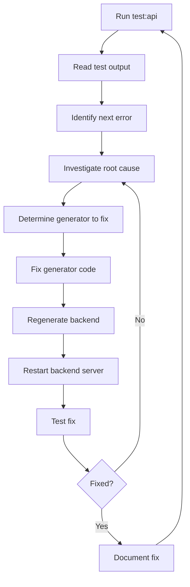

# API Troubleshooting Methodology Guide

## Overview

This document outlines the comprehensive methodology for systematically identifying, investigating, and resolving API endpoint issues using our generator-based development approach. This methodology has proven highly effective for maintaining API reliability and has been successfully used to resolve complex issues including database constraint violations, URL parameter mapping errors, and payload generation problems.

## Core Philosophy: Fix at the Source

**Golden Rule**: Always fix issues in the generator code, never hack the generated backend code. The generators are the single source of truth.

- ✅ **Correct**: Fix payload generation logic, URL parameter mapping, or backend generation templates
- ❌ **Incorrect**: Modify generated service files, add workarounds to backend code, or create service-level hacks

### Additional Rule: Resolve Missing Columns Properly

- ✅ When an error indicates a missing/undefined column (e.g., Postgres error 42703 or `column "xyz" does not exist`), add the column using the Missing Columns tool, not by hacking queries or bypassing code paths.
- ✅ After adding the column, re-run the API tests to verify the fix.

## Methodology Overview



## Step-by-Step Process

### Step 1: Run API Tests

Execute the comprehensive API test suite from the project root:

```bash
cd /path/to/chessboard-vanilla-v2
npm run test:api
```

This command:
- Runs `tools/test-api-connectivity-v3.js`
- Outputs results to `api_test_output.txt`
- Tests all endpoints with generated payloads
- Provides detailed error reporting

### Step 2: Analyze Test Output

Read the test output file to identify the next error to investigate:

```bash
cat api_test_output.txt
```

Look for the **first error** in the ERROR DETAILS section. Focus on:
- HTTP status code (400, 404, 500)
- Error message content
- Endpoint path and method
- Request payload (if applicable)
- Entity name and handler

**Example Error Analysis:**
```
1. PUT http://localhost:3001/api/users/profile
   Entity: users
   Handler: updateUserProfile
   Status: 400 Bad Request
   Payload: {
     "username": "testuser_123",
     "email": "test@example.com"
   }
   Response: {
     "error": "duplicate key value violates unique constraint \"users_username_key\""
   }
```

**Critical**: Always work on **Error #1** first. After identifying the first error, determine 3-4 possible causes for this specific error before proceeding. This helps ensure you're investigating the right direction and don't miss obvious solutions.

**Example Possible Causes Analysis:**
For the error above, possible causes could be:
1. Payload generator sending inappropriate username/email data for profile updates
2. Route handler allowing modification of immutable fields (username/email)
3. Database constraint preventing duplicate usernames from previous test runs
4. Missing validation logic to exclude username/email from profile update requests

### Step 3: Investigate Root Cause

Based on the error type, determine the likely cause:

#### 3.1 Database Constraint Violations (400 Bad Request)
- **Symptoms**: `duplicate key`, `null value in column`, `violates constraint`
- **Common Causes**: 
  - Payload generator sending inappropriate data
  - Missing required fields
  - Attempting to update immutable fields (username/email)

#### 3.2 Route Not Found (404 Not Found)
- **Symptoms**: `Route not found`, `Cannot GET/POST/PUT`
- **Common Causes**:
  - Backend generator missing route definitions
  - URL parameter mapping issues
  - Missing controller methods

#### 3.3 Implementation Placeholder Errors (400 Bad Request)
- **Symptoms**: `not implemented`, placeholder error messages
- **Common Causes**:
  - Backend generator templates contain placeholder code
  - Service methods not fully implemented

#### 3.4 URL Parameter Mapping Issues
- **Symptoms**: `Puzzle not found`, `Game not found` with valid IDs
- **Common Causes**:
  - Payload generator using wrong ID type for entity
  - URL parameter substitution logic incorrect

#### 3.5 Missing Column Errors (DB Schema)
- **Symptoms**: `column "..." does not exist`, `undefined column`, Postgres code 42703
- **Common Causes**:
  - Schema drift between generators/migrations and the live database
  - Recently added fields not yet created in DB
  - Incomplete seed/migration steps in local/dev DB

### Step 4: Determine Which Generator to Fix

Based on the root cause analysis:

| Issue Type | Generator to Fix | Location |
|------------|------------------|----------|
| Payload issues | Payload Generator | `tools/backend-tools/payload-generator/payload_generator.py` |
| Missing routes | Backend Generator | `tools/backend-tools/generator/` |
| Service implementations | Backend Generator | `tools/backend-tools/generator/` |
| URL parameter mapping | Payload Generator | `tools/backend-tools/payload-generator/payload_generator.py` |

### Step 5: Fix Generator Code

#### 5.1 Payload Generator Fixes

**Location**: `tools/backend-tools/payload-generator/payload_generator.py`

**Common Fix Patterns**:

```python
# Fix entity-specific payloads
elif entity_name == 'users':
    if 'profile' in path and method == 'PUT':
        # Profile updates should NOT change username/email
        return {
            'chess_elo': 1600,
            'puzzle_rating': 1550
        }

# Fix URL parameter mapping
def _extract_url_params(self, path: str, entity_name: str = None):
    if param == 'id':
        if entity_name == 'puzzles':
            params[param] = self.real_ids['puzzle_id']
        elif entity_name == 'games':
            params[param] = self.real_ids['game_id']
```

#### 5.2 Backend Generator Fixes

**Location**: `tools/backend-tools/generator/`

- Update service templates
- Add missing route definitions
- Fix controller method implementations
- Update database query logic

#### 5.3 Database Schema Fixes (Missing Columns)

When tests or logs report a missing/undefined column, add the column using the Missing Columns tool.

- Tool: `tools/backend-tools/missing-columns/missing-columns.py`
- NPM script (run from project root): `npm run missing:columns -- <command> [args]`

Common commands:

```bash
# Show table schema (verify before/after)
npm run missing:columns -- schema users

# Add a single column
# Syntax: add <table> <column> <type> [--default <value>] [--not-null]
npm run missing:columns -- add users display_name VARCHAR(255) --default 'Guest'

# Add JSONB default (pass JSON value; tool quotes appropriately)
npm run missing:columns -- add users preferences JSONB --default '{}'

# Use functions without quotes
npm run missing:columns -- add users created_at TIMESTAMP --default NOW() --not-null

# Batch add from JSON file or inline JSON
npm run missing:columns -- batch users ./column_defs.json
# or
npm run missing:columns -- batch users "[{\"name\":\"difficulty\",\"type\":\"VARCHAR(50)\",\"default\":\"medium\"}]"
```

Usage notes:
- Text types (VARCHAR/TEXT/CHAR): provide unquoted default (tool adds quotes).
- JSONB: provide JSON like `{}` or `[]` (do not nest extra quotes; the tool adds the necessary quoting).
- Functions (e.g., `NOW()`, `CURRENT_TIMESTAMP`): pass without quotes.
- `--not-null` flips nullability to NOT NULL.

### Step 6: Regenerate Backend Code

**Critical**: Always regenerate the backend after fixing generators:

```bash
# 1. Delete generated backend code
rm -rf backend-v2/src

# 2. Run backend generator
npm run backend:generator

# 3. Build the backend
cd backend-v2
npm run build
```

### Step 7: Restart Backend Server

**Critical**: The backend server must be restarted to pick up generated code changes:

```bash
# From project root directory

# 1. Stop existing backend server
pkill -f "node.*backend" || pkill -f "npm.*dev" || pkill -f "backend-v2"

# 2. Start backend server in background
cd backend-v2
npm run dev &

# 3. Wait for server to fully start (recommended)
sleep 3

# 4. Return to project root for testing
cd ..
```

**Note**: New routes, service methods, and configuration changes require a full server restart. Node.js will not automatically reload generated files.

### Step 8: Test the Fix

Run the API tests again to verify the fix:

```bash
npm run test:api
```

**Success Criteria**:
- The specific error no longer appears in the output
- Success rate increases
- No new errors introduced

### Verification for Missing Columns Fixes

After adding a column with the tool:
- Verify schema: `npm run missing:columns -- schema <table>` and confirm the column, data type, default, and nullability.
- Rerun tests: `npm run test:api` and confirm the previous `undefined column` error is gone.
- If the error persists, double‑check the exact table/column names and ensure the backend code uses the same identifiers.

### Step 9: Document and Continue

- Update any relevant documentation
- Commit the generator changes
- Move to the next error in the list

## Real-World Examples

### Example 1: Puzzle URL Parameter Bug

**Problem**: `POST /api/puzzles/:id/solve` returning "Puzzle not found"

**Investigation**: 
- Valid puzzle_id exists in database
- Service implementation correct
- Issue: URL parameter using `game_id` instead of `puzzle_id`

**Fix**: Updated `_extract_url_params()` in payload generator:
```python
if param == 'id':
    if entity_name == 'puzzles':
        params[param] = self.real_ids['puzzle_id']
    elif entity_name == 'games':
        params[param] = self.real_ids['game_id']
```

**Result**: Puzzle endpoints now work correctly

### Example 2: User Profile Constraint Violation

**Problem**: `PUT /api/users/profile` causing duplicate username constraint

**Investigation**:
- Payload generator sending random usernames for profile updates
- Database constraint prevents duplicate usernames
- Profile updates shouldn't modify username/email

**Fix**: Added entity-specific payload logic:
```python
elif entity_name == 'users':
    if 'profile' in path and method == 'PUT':
        return {
            'chess_elo': 1600,
            'puzzle_rating': 1550
        }
```

**Result**: Profile updates work without constraint violations

## Best Practices

### Do's ✅

1. **Always investigate systematically** - Don't skip errors or fix randomly
2. **Fix generators, not generated code** - Maintain single source of truth
3. **Test incrementally** - Fix one error at a time
4. **Document patterns** - Record common fix patterns for future reference
5. **Regenerate completely** - Always delete `backend-v2/src` before regenerating

### Don'ts ❌

1. **Don't modify generated backend code** - Changes will be overwritten
2. **Don't work around issues** - Fix the root cause
3. **Don't batch multiple fixes** - Test each fix individually
4. **Don't ignore test output** - Every error provides valuable information
5. **Don't skip regeneration** - Always regenerate after generator changes

## Tools and Commands

### Essential Commands

```bash
# Run API tests
npm run test:api

# View test results
cat api_test_output.txt

# Regenerate backend
rm -rf backend-v2/src && npm run backend:generator

# Build backend
cd backend-v2 && npm run build

# Check backend logs
cd backend-v2 && npm run dev

# Missing columns tool (run from project root)
npm run missing:columns -- -h
npm run missing:columns -- schema <table>
npm run missing:columns -- add <table> <column> <type> [--default <value>] [--not-null]
```

### Key Files

| File | Purpose |
|------|---------|
| `api_test_output.txt` | Detailed test results and error analysis |
| `tools/backend-tools/payload-generator/payload_generator.py` | Payload generation logic |
| `tools/backend-tools/payload-generator/generated_payloads.json` | Generated test payloads |
| `tools/backend-tools/payload-generator/real_test_ids.json` | Real database IDs for testing |
| `tools/test-api-connectivity-v3.js` | Comprehensive API test suite |

## Metrics and Success Criteria

### API Health Metrics

- **Success Rate**: Percentage of endpoints returning 200/201
- **Error Distribution**: Breakdown of 400/404/500 errors
- **Coverage**: Number of endpoints tested vs total endpoints

### Success Benchmarks

- **Good**: 70%+ success rate
- **Excellent**: 85%+ success rate
- **Target**: 90%+ success rate for implemented features

## Advanced Troubleshooting

### Complex Multi-Layer Issues

Some issues require fixes across multiple generators:

1. **Backend Generator**: Add missing route/service
2. **Payload Generator**: Create appropriate test payload
3. **Database Migration**: Update schema if needed

### Database-Specific Issues

- Check `backend-v2/.env` for database connection
- Verify `tools/backend-tools/payload-generator/real_test_ids.json` has valid IDs
- Run `tools/backend-tools/db_query.py` to refresh test IDs

### Performance Considerations

- Run tests in parallel where possible
- Use background processes for long-running services
- Monitor database connection limits during testing

## Conclusion

This methodology provides a systematic approach to API troubleshooting that:

- Ensures fixes are made at the correct architectural level
- Maintains code generation integrity
- Provides measurable progress through success rates
- Scales effectively as the API grows

By following this process, developers can efficiently resolve API issues while maintaining the benefits of the generator-based architecture.

---

*This document should be updated as new patterns emerge and the methodology evolves.*
