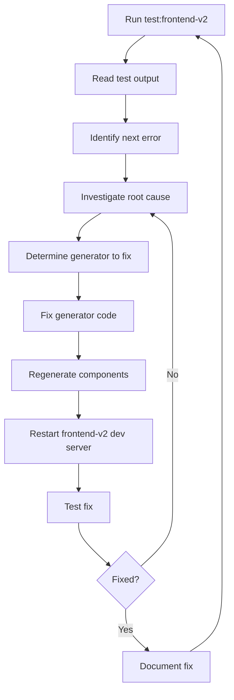

# Frontend-v2 Troubleshooting Methodology Guide

## Overview

This document outlines the comprehensive methodology for systematically identifying, investigating, and resolving frontend-v2 issues using our generator-based development approach. This methodology focuses on the dynamic action system, page routing, mobile responsiveness, and component architecture specific to the frontend-v2 codebase.

## Core Philosophy: Fix at the Source

**Golden Rule**: Always fix issues in the generator code, never hack the generated frontend code. The generators are the single source of truth.

- ✅ **Correct**: Fix page generator templates, component wrapper generation, or dynamic action system
- ❌ **Incorrect**: Modify generated components, add workarounds to pages, or create component-level hacks

### Additional Rule: Maintain Architecture Consistency

- ✅ When an error indicates missing components or broken imports, verify the generator created all necessary files following the established architecture
- ✅ After fixing generators, regenerate all affected components and verify the complete workflow
- ✅ Ensure dynamic action system integration is properly maintained

## Methodology Overview



## Step-by-Step Process

### Step 1: Run Frontend-v2 Tests

Execute the comprehensive frontend-v2 test suite from the project root:

```bash
cd /path/to/chessboard-vanilla-v2
npm run test:frontend-v2
```

This command:
- Runs `tools/test-frontend-v2-connectivity.js`
- Outputs results to `frontend_v2_test_output.txt`
- Tests all pages, components, and routing
- Tests dynamic action system integration
- Provides detailed error reporting

### Step 2: Analyze Test Output

Read the test output file to identify the next error to investigate:

```bash
cat frontend_v2_test_output.txt
```

Look for the **first error** in the ERROR DETAILS section. Focus on:
- Page routing issues (404, component not found)
- Dynamic action system failures
- Missing component imports
- Mobile responsive wrapper issues
- Hook detection problems

**Example Error Analysis:**
```
1. GET http://localhost:5173/uitests/testpage
   Page: TestPage
   Parent: uitests
   Status: Component Error
   Error: Cannot resolve module '../../hooks/core/usePageInstructions'
   Component: TestPagePageWrapper
   Generator: dynamic_page_generator.py
```

**Critical**: Always work on **Error #1** first. After identifying the first error, determine 3-4 possible causes before proceeding.

**Example Possible Causes Analysis:**
For the error above, possible causes could be:
1. Generator using wrong hook detection logic for frontend-v2
2. Component wrapper generated with incorrect imports
3. Missing hook files in frontend-v2 structure
4. Generator not adapting to frontend-v2 architecture

### Step 3: Investigate Root Cause

Based on the error type, determine the likely cause:

#### 3.1 Component Import Errors
- **Symptoms**: `Cannot resolve module`, `Module not found`, missing imports
- **Common Causes**: 
  - Generator using wrong paths for frontend-v2
  - Hook detection logic failing
  - Missing component generation

#### 3.2 Page Routing Issues
- **Symptoms**: `Page not found`, `Component not rendered`, blank pages
- **Common Causes**:
  - Parent page routing logic not updated
  - Missing component imports in parent page
  - ActionSheetContainer not properly updated

#### 3.3 Dynamic Action System Failures
- **Symptoms**: `Actions not loading`, `DYNAMIC_PAGE_ACTIONS undefined`, no action sheet
- **Common Causes**:
  - Dynamic action files not created in correct location
  - Page action files missing required exports
  - ActionSheetContainer not detecting dynamic system

#### 3.4 Mobile Responsive Issues
- **Symptoms**: `useIsMobile not defined`, incorrect component rendering
- **Common Causes**:
  - Generator assuming hooks exist when they don't
  - Mobile detection placeholder not created
  - Wrapper generation logic incorrect

#### 3.5 Navigation and State Issues
- **Symptoms**: `setCurrentChildPage not working`, navigation broken
- **Common Causes**:
  - Parent action files missing onPress handlers
  - AppStore integration incorrect
  - Navigation actions not properly generated

### Step 4: Determine Which Generator to Fix

Based on the root cause analysis:

| Issue Type | Generator to Fix | Location |
|------------|------------------|----------|
| Component wrapper issues | Dynamic Page Generator | `tools/frontend-tools/mobile-pages/dynamic_page_generator.py` |
| Parent page routing | Page Generator | `tools/frontend-tools/mobile-pages/page_generator.py` |
| Hook detection | Both Generators | Wrapper generation methods |
| Action system integration | Dynamic Page Generator | Action sheet and parent action methods |

### Step 5: Fix Generator Code

#### 5.1 Dynamic Page Generator Fixes

**Location**: `tools/frontend-tools/mobile-pages/dynamic_page_generator.py`

**Common Fix Patterns**:

```python
# Fix hook detection for frontend-v2
def _create_responsive_wrapper(self, config: PageConfig) -> None:
    # Check if hooks exist in this frontend
    hooks_dir = self.frontend_root / "src" / "hooks" / "core"
    has_page_hooks = (hooks_dir / "usePageInstructions.ts").exists() and (hooks_dir / "usePageActions.ts").exists()
    has_mobile_hook = (hooks_dir / "useIsMobile.ts").exists()
    
    if not has_page_hooks:
        # Generate wrapper without hooks for frontend-v2
        content = f'''import React from "react";
import {{ {config.name}Page }} from "../../pages/{config.parent}/{config.name}Page";

export const {config.name}PageWrapper: React.FC = () => {{
  return <{config.name}Page />;
}};'''

# Fix dynamic action system integration
def _update_action_sheet_container(self, config: PageConfig) -> None:
    if 'DYNAMIC_PAGE_ACTIONS' in content:
        # Frontend-v2 uses dynamic system - no manual updates needed
        print(f"  ✅ Detected dynamic action system")
        return
```

#### 5.2 Parent Action Integration Fixes

```python
# Ensure navigation actions are properly added with onPress handlers
def _update_parent_dynamic_actions(self, config: PageConfig, parent_action_path: Path) -> None:
    nav_action = f"""    {{
      id: 'go-to-{page_id}',
      label: 'Go to {config.name}',
      icon: Navigation,
      variant: 'secondary',
      onPress: () => {{
        const setCurrentChildPage = useAppStore.getState().setCurrentChildPage;
        setCurrentChildPage('{page_id}');
      }}
    }}"""
```

### Step 6: Regenerate Frontend-v2 Code

**Critical**: Always regenerate the frontend-v2 after fixing generators:

```bash
# 1. Delete generated frontend-v2 code
rm -rf frontend-v2/src

# 2. Run frontend-v2 generator
npm run frontend:generator

# 3. Build the frontend-v2
cd frontend-v2
npm run build

# 4. Return to project root
cd ..
```
```

### Step 7: Restart Frontend-v2 Dev Server

**Critical**: The frontend-v2 dev server should auto-reload, but restart if issues persist:

```bash
# From project root directory

# 1. Stop existing frontend server (if needed)
pkill -f "vite.*5173" || pkill -f "npm.*dev.*frontend-v2"

# 2. Start frontend-v2 dev server in background
cd frontend-v2
npm run dev &

# 3. Wait for server to fully start
sleep 3

# 4. Return to project root for testing
cd ..
```

### Step 8: Test the Fix

Run the frontend-v2 tests again to verify the fix:

```bash
npm run test:frontend-v2
```

**Success Criteria**:
- The specific error no longer appears in the output
- Page renders correctly
- Navigation works properly
- Action sheets function as expected
- Mobile responsiveness maintained

### Step 9: Document and Continue

- Update any relevant documentation
- Commit the generator changes
- Move to the next error in the list

## Real-World Examples

### Example 1: Hook Import Error

**Problem**: `TestPagePageWrapper` trying to import non-existent hooks in frontend-v2

**Investigation**: 
- Frontend-v2 doesn't have `usePageInstructions` or `usePageActions`
- Generator hook detection failing
- Wrong wrapper template being used

**Fix**: Updated `_create_responsive_wrapper()` with proper hook detection:
```python
hooks_dir = self.frontend_root / "src" / "hooks" / "core"
has_page_hooks = (hooks_dir / "usePageInstructions.ts").exists()
if not has_page_hooks:
    # Generate simplified wrapper for frontend-v2
```

**Result**: Component wrappers generate without missing imports

### Example 2: Dynamic Action System Not Working

**Problem**: Action sheet showing "No actions available" despite action files existing

**Investigation**:
- Action files created in correct location
- ActionSheetContainer exists and uses DYNAMIC_PAGE_ACTIONS
- Parent action missing navigation to child page

**Fix**: Added proper parent action update with onPress handler:
```python
nav_action = f"""    {{
      id: 'go-to-{page_id}',
      label: 'Go to {config.name}',
      icon: Navigation,
      variant: 'secondary',
      onPress: () => {{
        const setCurrentChildPage = useAppStore.getState().setCurrentChildPage;
        setCurrentChildPage('{page_id}');
      }}
    }}"""
```

**Result**: Navigation actions work and pages load correctly

## Best Practices

### Do's ✅

1. **Always test generators against both frontend and frontend-v2** - Ensure compatibility
2. **Fix generators, not generated components** - Maintain single source of truth
3. **Test complete workflows** - Page creation → Action integration → Navigation
4. **Verify hook detection logic** - Ensure proper adaptation to different frontend structures
5. **Test mobile responsiveness** - Both desktop and mobile component variants

### Don'ts ❌

1. **Don't modify generated components** - Changes will be overwritten
2. **Don't assume hook availability** - Check existence before generating imports
3. **Don't skip action system integration** - Always verify complete navigation flow
4. **Don't ignore component architecture** - Follow established patterns
5. **Don't batch multiple generator fixes** - Test each fix individually

## Tools and Commands

### Essential Commands

```bash
# Run frontend-v2 tests
npm run test:frontend-v2

# View test results
cat frontend_v2_test_output.txt

# Regenerate frontend-v2 (full regeneration)
rm -rf frontend-v2/src && npm run frontend:generator

# Build frontend-v2
cd frontend-v2 && npm run build

# Test page generator manually
cd tools/frontend-tools/mobile-pages
python dynamic_page_generator.py child TestPage --parent uitests --mobile --frontend-root ../../../frontend-v2

# Start frontend-v2 dev server
cd frontend-v2 && npm run dev

# Check frontend-v2 logs (dev server)
cd frontend-v2 && npm run dev
```

### Key Files

| File | Purpose |
|------|---------|
| `frontend_v2_test_output.txt` | Detailed test results and error analysis |
| `tools/frontend-tools/mobile-pages/dynamic_page_generator.py` | Recommended page generator |
| `tools/frontend-tools/mobile-pages/page_generator.py` | Legacy page generator |
| `frontend-v2/src/constants/actions/page-actions.dynamic.ts` | Dynamic action system |
| `frontend-v2/src/components/ui/ActionSheetContainer.tsx` | Action sheet container |
| `tools/test-frontend-v2-connectivity.js` | Comprehensive frontend test suite |

## Conclusion

This methodology provides a systematic approach to frontend-v2 troubleshooting that:

- Ensures fixes are made at the correct generator level
- Maintains component generation integrity
- Provides measurable progress through success metrics
- Scales effectively as the frontend-v2 grows

By following this process, developers can efficiently resolve frontend-v2 issues while maintaining the benefits of the generator-based architecture and the dynamic action system.

---

*This document should be updated as new patterns emerge and the frontend-v2 architecture evolves.*